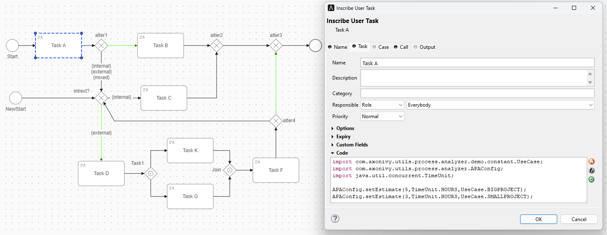

# Advanced Process Analyzer

Axon Ivy’s Advanced Process Analyzer tool helps you to calculate duration to finish a workflow case. Key features:

- Configure needed information directly in the process model
	- Default duration of a task for multiple use cases. Each task can have multiple named default durations.
	- Different “happy path” flows. It’s possible to set multiple named process paths.
- Possibilities to override settings of the process model
	- Override duration
	- Override default path for the gateways
- Create a list of all tasks in the process.
- Get configured duration for a task.
- Get all upcoming tasks on a configured process path with expected start timestamp for each task.

## Setup

In the project, you only add the dependency in your pom.xml and call public APIs

**1. Add dependency**
```XML
	<dependency>
		<groupId>com.axonivy.utils.process.analyzer</groupId>
		<artifactId>process-analyzer</artifactId>
		<version>${process.analyzer.version}</version>
	</dependency>
```
**2. Call the constructor to set some basic information.  Each instance of the advanced process analyzer should care about one specific process model. This way we can store some private information (e.g. simplified model) in the instance and reuse it for different calculations on this object.**
```java
	/** 
	 * @param process - The process that should be analyzed.	 
	 */
	public AdvancedProcessAnalyzer(Process process)
```
**3. You can custom the process flow or task duration**
```java
	/**
	 * This method can be used to override configured path taken after an alternative gateway.
	 * @param processFlowOverrides
	 * key: element ID + task identifier (for support of callable sub-processes, we also need to add the path of parent elements. However, not needed in first versions.)
	 * value: chosen output PID
	 * @return
	 */
	public AdvancedProcessAnalyzer setProcessFlowOverrides(HashMap<String, String> processFlowOverrides)
	
	/**
	 * This method can be used to override configured task duration of the model by own values.
	 * @param durationOverrides
	 * key: element ID + task identifier (for support of callable sub-processes, we also need to add the path of parent elements. However, not needed in first versions.)
	 * value: new duration
	 * @return
	 */
	public AdvancedProcessAnalyzer setDurationOverrides(HashMap<String, Duration> durationOverrides)
	
	/**
	 * Disabled by default.
	 * If this option is enabled, the Advanced Process Analyzer will also add all alternative elements to the result.
	 * This option will affect findTasksOnPath as well as findAllTasks method. Both methods will traverse the process as usual.
	 * When it bypasses an alternative element, it will be added to the result list.
	 */
	public void enableDescribeAlternativeElements()
	public void disableDescribeAlternativeElements()
``` 
**4. You can call `findAllTasks`, `findTasksOnPath`, `calculateEstimatedDuration` to analyze your process.**
```java
	/**
	 * Return a list of all tasks in the process which can be reached from the starting element.
	 * @param startAtElement - Element where we start traversing the process
	 * @param useCase - Use case that should be used to read duration values. Durations will be set to 0 in case not provided.
	 * If it is null, it will get first duration configure line
	 * @param flowName - Tag name we want to follow at alternative gateways.
	 * @throws Exception
	 */
	public List<? extends DetectedElement> findAllTasks(BaseElement startAtElement, Enum<?> useCase) throws Exception

	/**
	 * Return a list of all tasks which are created when process follows the tagged flow. Uses the flow name set in the constructor.
	 * @param startAtElement - Element where we start traversing the process
	 * @param useCase - Use case that should be used to read duration values. Durations will be set to 0 in case not provided.
	 * If it is null, it will get first duration configure line
	 * @param flowName - Tag name we want to follow at alternative gateways.
	 * @throws Exception
	 */
	public List<? extends DetectedElement> findTasksOnPath(BaseElement startAtElement, Enum<?> useCase, String flowName) throws Exception
	
	/**
	 * This method can be used to calculate expected worst case duration from a starting point in a process until all task are done and end of process is reached.
	 * In case of parallel process flows, it will always use the “critical path” (which means path with longer duration).
	 * @param startElement - Element where we start traversing the process
	 * @param useCase - Use case that should be used to read duration values. Durations will be set to 0 in case not provided.
	 * If it is null, it will get first duration configure line
	 * @param flowName - Tag name we want to follow at alternative gateways.
	 * @throws Exception
	 */
	public Duration calculateWorstCaseDuration(BaseElement startElement, Enum<?> useCase) throws Exception
```

### Example

- Now we will practice How to analyze the process below with some scenarios.
 
 
**1. How to analyze the workflow base on the flow name {external} with use case BIGPROJECT?**
```java
	// We create a new process analyzer with UseCase.BIGPROJECT and flowName is "external"
	var processAnalyzer = new AdvancedProcessAnalyzer(process);	
	public List<DetectedElement> detectedTasks = processAnalyzer.findTasksOnPath(start, UseCase.BIGPROJECT, "external");
	
	// The result is list of task on path: Task A -> Task D -> Task1A -> Task K -> Task1B -> Task G -> Task F
	// At the alternative, the path taken is base on the flow name or default path (the condition is empty)  
	// The task's duration will base on the configuration BIGPROJECT. So duration Task A is 5 hours
```
	
**2. How to analyze the workflow base on the process flow override?**
```java
	// We create a new process analyzer with flowName is null.
	// Basically, the path taken after alternative will base on default path. But we will override it by setProcessFlowOverrides API
	var processAnalyzer = new AdvancedProcessAnalyzer(process);
	var flowOverrides = new HashMap<String, String>();
	flowOverrides.put("18E180A64355D4D9-f4", "18E180A64355D4D9-f13"); //alter1 -> sequence flow {internal}\n{external}\n{mixed}
	flowOverrides.put("18E180A64355D4D9-f12", "18E180A64355D4D9-f14"); //int/ext? -> sequence flow {internal}
	processAnalyzer.setProcessFlowOverrides(flowOverrides);
		
	public List<DetectedElement> detectedTasks = processAnalyzer.findTasksOnPath(start, null, null);
	
	// The result is list of task on path: Task A -> Task C	
```

## Demo

- Select the process and some configuration which need for your analysis

- Hit the **Run** button to get the analysis result


